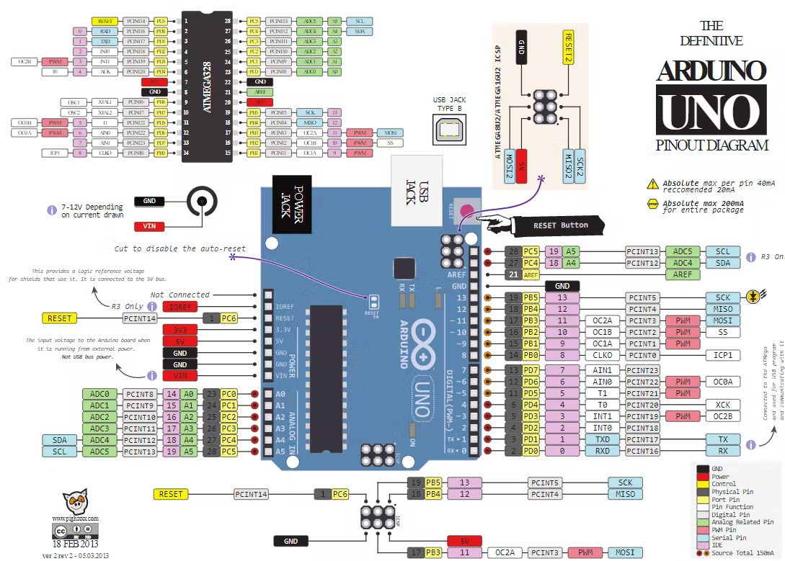

# Micro-controllers

## Arduino

Use https://www.tinkercad.com/ for designing and prototyping.

Refer to https://docs.arduino.cc/hardware/uno-rev3 for more resouces.

Get started with Arduino using Python: https://realpython.com/arduino-python/

Q: Why are pin 0 and 1 always high on voltage?
A: Refer to https://forum.arduino.cc/t/pins-0-and-1-rx-tx-stuck-on-high-solved/141825/2. "Pins 0 and 1 are used for serial communications and it's normal for them both to be a steady high when there is no actual data being sent, that is the default stop condition for serial data. It's really not possible to use pins 0 and 1 for external circuitry and still be able to utilize serial communications or to upload new sketches to the board."

Q: What is the max current draw for Arduino?
A: Each digital pin can produce (at maximum) 40 mA?

Q: For Arduino, can i connect both usb and external power via Vin?
A: Yes. Refer to https://forum.arduino.cc/t/vin-power-usb-power/397029

Q: Arduino UNO pinout.
A: Refer to https://www.circuito.io/blog/arduino-uno-pinout/.

Q: How do you power up Arduino?
A: Refer to this [link](https://thepihut.com/blogs/raspberry-pi-tutorials/how-do-i-power-my-arduino)

Q: How to control Arduino pins?
A: One possible and easy way is to use Firmata protocol.
Firmata provides a way for the computer to communicate with the microcontrollers.

For arduino, there're multiple implementations in firmwares which are included in the Arduino IDE examples. This means the logic on the Arduino board is taken care of by the relevant sketch we choose to upload to the board (I'm using StandardFirmata).

On the other hand, the firmata protocol can also be implemented on the software side on the host machine (Raspberry Pi, PCs, or Mac), and in this case, I'm using the pyFirmata package to communicate with Arduino. So this protocol provides a common way for the software and hardware to communicate.

For the input/output controls, I only need to focus on how to use the pyFirmata package to turn on/off the corresponding pins according to the documentation and it's pretty straightforward. It's quick to debug with the breadboard.

Pros:

1. Compared to setting up my own protocol/rules on Arduino and using pyserial on the host machine, the workflow is simpler with pyFirmata because the firmata protocol is standardised and included, and I can only focus on the host side.
2. The functions in the pyFirmata are easy to use for reading digital/analog inputs and sending data to digital/analog outputs.
3. As long as the host has a program utilising Firmata protocol (in python or other language), it can communicate with the Arduino.

Cons:

1. Can't use pin 0, 1 for UNO, and pin 0, 1, 14, 15 for Mega because Firmata is using these pins for special purposes (it's using MIDI which is also a serial protocol).

References:

1. Using Firmata On Arduino Compatible Boards
2. Firmata: Towards making microcontrollers act like extensions of the computer

## Raspberry Pi

### Raspberry Pi pinout

Note: All GPIOs work at 3.3V. If you need to make your Raspberry Pi 4 GPIOs communicate with 5V pins directly (ex: Arduino Uno or Mega), you’ll need to use a 3.3V to 5V level shifter.

Q: How do you power up Raspberry Pi?
A: [link](https://thepihut.com/blogs/raspberry-pi-tutorials/how-do-i-power-my-raspberry-pi)

### Raspberry Pi accessories

1. [USB to TTL Serial Cable - Debug / Console Cable for Raspberry Pi](https://thepihut.com/products/usb-to-ttl-serial-cable-debug-console-cable-for-raspberry-pi)
   1. Inside the big USB plug is a USBSerial conversion chip and at the end of the 36" cable are four wire - red power, black ground, white RX into USB port, and green TX out of the USB port. The power pin provides the 5V @ 500mA direct from the USB port and the RX/TX pins are 3.3V level for interfacing with the most common 3.3V logic level chipsets.
2.

### Raspberry Pi connection

#### RPI with Arduino

Raspberry Pi Arduino Serial Communication:

## Reference

1. [RPI pinout](https://roboticsbackend.com/raspberry-pi-3-pins/)
2. [Raspberry Pi Arduino Serial Communication](https://roboticsbackend.com/raspberry-pi-arduino-serial-communication/)
